# Todo Application SystemDesign

---

## Project Goal

Build a full-stack task management application where users can:

- Register
- Login
- Create tasks
- View tasks
- Edit tasks
- Delete tasks
- Mark tasks as completed
- Search tasks
- Filter tasks
- Sort tasks

---

# High-Level Architecture

<aside>

Below are simple “picture-like” diagrams for each major concept. These are meant to be quick to scan during revision.

</aside>

```
┌─────────────────┐
│     React UI    │
└────────┬────────┘
         │ HTTP Request
         ▼
┌─────────────────┐
│ Express Backend │
└────────┬────────┘
         │ Mongoose
         ▼
┌─────────────────┐
│    MongoDB      │
└─────────────────┘
```

## Architecture (visual)

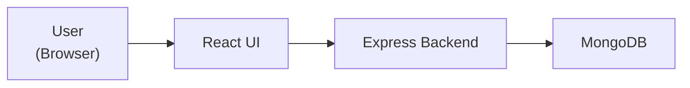

---

# Data Flow Diagrams

## Core Task CRUD Data Flow

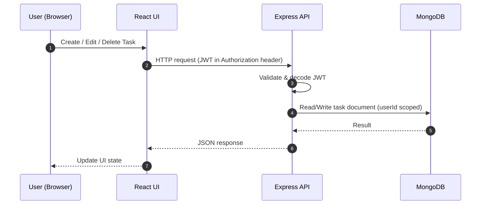

## Search / Filter / Sort / Pagination Data Flow

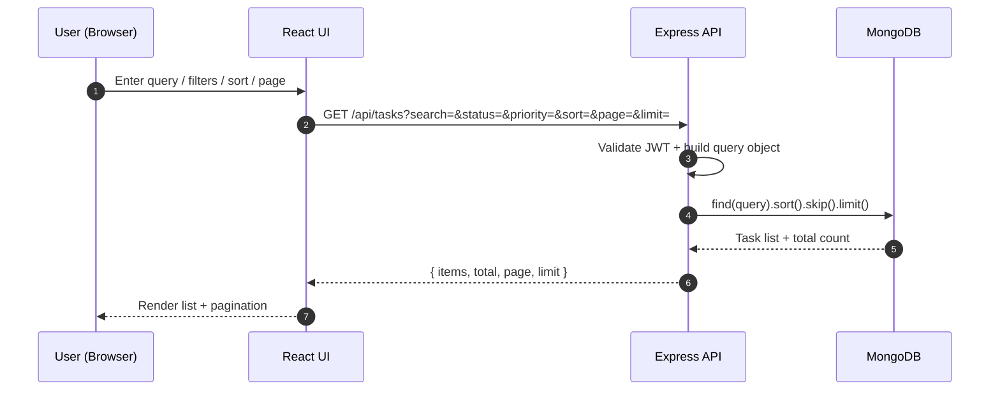

---

# Frontend Structure

```
frontend
│
├── src
│   │
│   ├── pages
│   │   ├── Login
│   │   ├── Register
│   │   └── Dashboard
│   │
│   ├── components
│   │   ├── Navbar
│   │   ├── TaskCard
│   │   ├── TaskList
│   │   ├── TaskForm
│   │   └── SearchBar
│   │
│   ├── services
│   │   ├── authService
│   │   └── taskService
│   │
│   ├── context
│   │   └── AuthContext
│   │
│   ├── routes
│   │   └── ProtectedRoute
│   │
│   └── App
│
└── package.json
```

---

# Backend Structure

```
backend
│
├── src
│   │
│   ├── config
│   │   └── db.js
│   │
│   ├── models
│   │   ├── User.js
│   │   └── Task.js
│   │
│   ├── controllers
│   │   ├── authController.js
│   │   └── taskController.js
│   │
│   ├── routes
│   │   ├── authRoutes.js
│   │   └── taskRoutes.js
│   │
│   ├── middleware
│   │   └── authMiddleware.js
│   │
│   ├── services
│   │
│   ├── utils
│   │
│   └── app.js
│
└── server.js
```

---

# Database Design

## Database

```
todo-app
```

Collections:

```
users
tasks
```

## Database at a glance (visual)

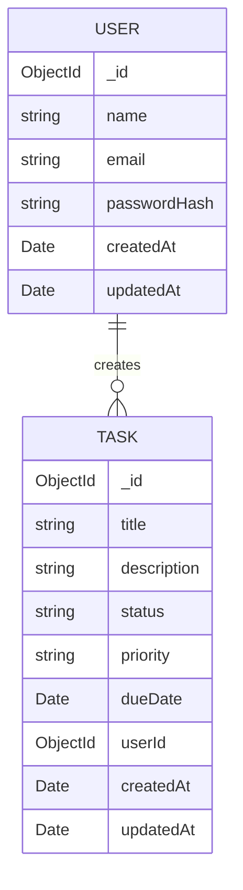

---

# User Collection

```json
{
  "_id": ObjectId,
  "name": "Arka",
  "email": "arka@gmail.com",
  "password": "hashedPassword",
  "createdAt": Date,
  "updatedAt": Date
}
```

---

# Task Collection

```json
{
  "_id": ObjectId,
  "title": "Learn MongoDB Aggregation",
  "description": "Practice lookup and group",
  "status": "pending",
  "priority": "high",
  "dueDate": Date,
  "userId": ObjectId,
  "createdAt": Date,
  "updatedAt": Date
}
```

---

# Entity Relationship

```
User
 │
 │ 1
 │
 ▼
Task

One User
   ↓
Many Tasks
```

Relationship:

```jsx
Task.userId -> User._id
```

This is a One-to-Many relationship.

---

# Authentication Flow

## Registration

```
User
  ↓
POST /api/auth/register
  ↓
Hash Password
  ↓
Save User
  ↓
Success
```

## Registration (visual)

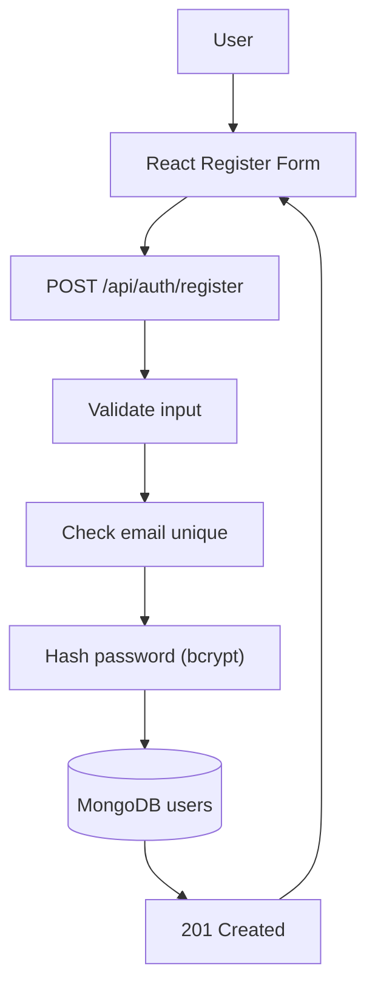

---

## Login

```
User
  ↓
POST /api/auth/login
  ↓
Verify Password
  ↓
Generate JWT
  ↓
Return Token
```

## Login (visual)

```mermaid
flowchart TD
	U[User] --> UI[React Login Form]
	UI --> API["POST /api/auth/login"]
	API --> DB[(MongoDB users)]
	DB --> CMP[Compare password (bcrypt)]
	CMP --> JWT[Sign JWT]
	JWT --> RES[Return token]
	RES --> UI
```

---

# Auth Flow Diagrams

## Registration Flow (Detailed)

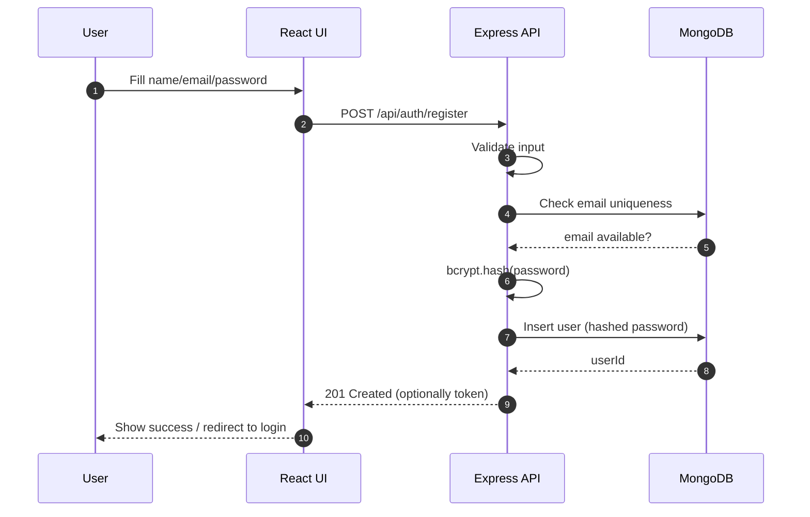

## Login Flow (JWT Issue)

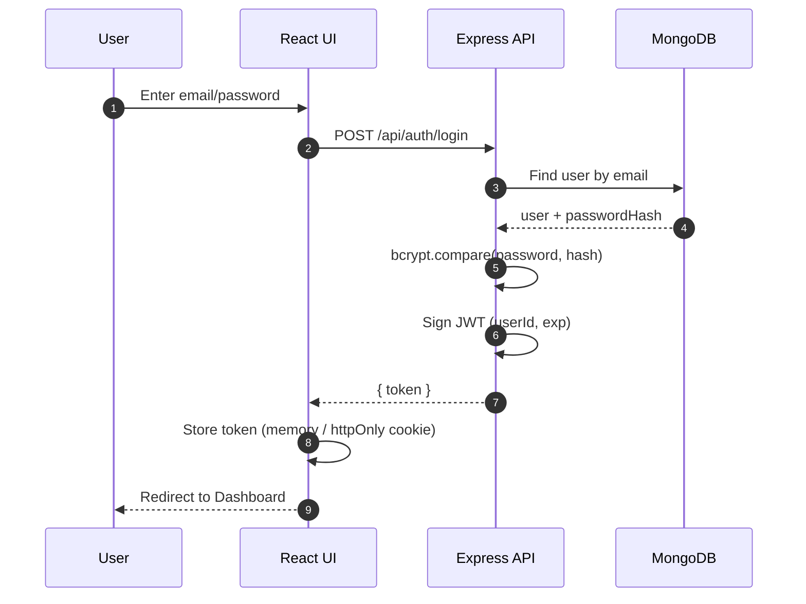

## Protected Route / Request Auth (JWT Validation)

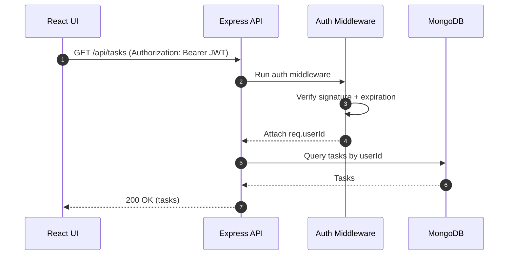

---

# API Design

## Authentication APIs

### Register User

```
POST /api/auth/register
```

Request:

```json
{
  "name": "Arka",
  "email": "arka@gmail.com",
  "password": "password123"
}
```

---

### Login User

```
POST /api/auth/login
```

Request:

```json
{
  "email": "arka@gmail.com",
  "password": "password123"
}
```

Response:

```json
{
  "token": "jwt-token"
}
```

---

# Task APIs

## Create Task

```
POST /api/tasks
```

Request:

```json
{
  "title": "Learn React",
  "description": "Hooks and Context API",
  "priority": "high",
  "dueDate": "2026-06-15"
}
```

---

## Get All Tasks

```
GET /api/tasks
```

Returns all tasks belonging to logged-in user.

---

## Get Single Task

```
GET /api/tasks/:id
```

---

## Update Task

```
PUT /api/tasks/:id
```

Request:

```json
{
  "title": "Learn Advanced React",
  "status": "completed"
}
```

---

## Delete Task

```
DELETE /api/tasks/:id
```

---

# Advanced APIs

## Search Tasks

```
GET /api/tasks?search=react
```

---

## Filter By Status

```
GET /api/tasks?status=completed
```

---

## Filter By Priority

```
GET /api/tasks?priority=high
```

---

## Sort Tasks

```
GET /api/tasks?sort=createdAt
```

---

## Pagination

```
GET /api/tasks?page=1&limit=10
```

---

# API map (visual)

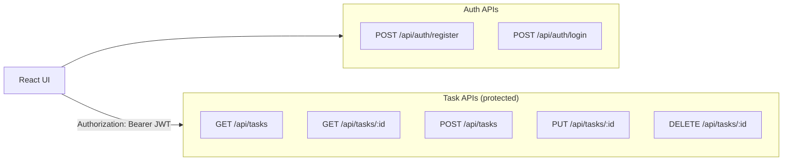

# MongoDB Indexes

These improve performance.

### User

```jsx
email
```

Unique index.

---

### Task

```jsx
userId
```

---

```jsx
status
```

---

```jsx
priority
```

---

```jsx
createdAt
```

---

# Security

## Password Hashing

Use:

```
bcrypt
```

Never store plain passwords.

---

## Authentication

Use:

```
JWT
```

Every protected API requires:

```
Authorization: Bearer token
```

---

# Frontend Pages

## Register Page

Features:

- Name
- Email
- Password
- Register button

---

## Login Page

Features:

- Email
- Password
- Login button

---

## Dashboard

Features:

- User info
- Logout button
- Create task form
- Task list

---

# Dashboard Components

## Task Form

Fields:

```
Title
Description
Priority
Due Date
```

---

## Task Card

Displays:

```
Title
Description
Priority
Status
Created Date
Due Date
```

Buttons:

```
Edit
Delete
Complete
```

---

# Application Flow

```
Register
   ↓
Login
   ↓
Receive JWT
   ↓
Store Token
   ↓
Dashboard
   ↓
Create Task
   ↓
View Tasks
   ↓
Update Task
   ↓
Delete Task
```

---

# **🚀 APP Versions**

# Phase 1 - Core Productivity App

## Features

### Authentication

- [ ]  User Registration
- [ ]  User Login
- [ ]  JWT Authentication
- [ ]  Logout

### Projects

- [ ]  Create Project
- [ ]  Get Project
- [ ]  Update Project
- [ ]  Delete Project

### Tasks

- [ ]  Create Task
- [ ]  Get Task
- [ ]  Update Task
- [ ]  Delete Task

### Comments

- [ ]  POST /api/tasks/:taskId/comments
- [ ]  GET /api/tasks/:taskId/comments
- [ ]  PUT /api/comments/:commentId
- [ ]  DELETE /api/comments/:commentId

### Audit Logs

- [ ]  Track Task Creation
- [ ]  Track Task Updates
- [ ]  Track Task Deletion
- [ ]  Track Comment Activities

### Backend Fundamentals

- [ ]  Input Validation
- [ ]  Error Handling
- [ ]  Authorization Middleware
- [ ]  Protected Routes

### Database Concepts

- [ ]  One-to-Many Relationships
- [ ]  Many-to-One Relationships
- [ ]  Database Indexes
- [ ]  Foreign Keys

### Goal

Build a secure multi-user task management system.

---

# Phase 2 - Querying & Scalability

## Features

### Search

- [ ]  Search Tasks by Title
- [ ]  Search Tasks by Description

### Filtering

- [ ]  Filter by Status
- [ ]  Filter by Priority
- [ ]  Filter by Due Date

### Sorting

- [ ]  Sort by Created Date
- [ ]  Sort by Updated Date
- [ ]  Sort by Due Date
- [ ]  Sort by Priority

### Pagination

- [ ]  Page-based Pagination
- [ ]  Metadata Response

### Dashboard Statistics

- [ ]  Total Tasks
- [ ]  Completed Tasks
- [ ]  Pending Tasks
- [ ]  Overdue Tasks

### Database Concepts

- [ ]  MongoDB Aggregations
- [ ]  Query Optimization
- [ ]  Explain Plans
- [ ]  Indexing Strategy

### Goal

Learn how production systems handle large datasets efficiently.

---

# Phase 3 - Advanced Authentication

## Week A

- [ ]  Access Tokens
- [ ]  Refresh Tokens
- [ ]  Why Refresh Tokens Exist
- [ ]  Token Expiry Strategies

## Week B

- [ ]  Cookies vs LocalStorage
- [ ]  HttpOnly Cookies
- [ ]  Secure Cookies
- [ ]  SameSite Cookies
- [ ]  CSRF Protection

## Week C

- [ ]  Token Rotation
- [ ]  Refresh Token Theft
- [ ]  Session Management

## Week D

- [ ]  Redis Fundamentals
- [ ]  Token Blacklisting
- [ ]  Logout From All Devices
- [ ]  Token Revocation

### Goal

Understand how authentication is implemented in production systems.

---

# Phase 3.5 - DevOps & Deployment

## Docker

- [ ]  Docker Basics
- [ ]  Dockerfile
- [ ]  Docker Compose

## Deployment

- [ ]  Environment Variables
- [ ]  Logging
- [ ]  Health Check Endpoint
- [ ]  Deploy Backend

## CI/CD

- [ ]  GitHub Actions Basics
- [ ]  Automated Build
- [ ]  Automated Deployment

### Goal

Learn how backend services are deployed and maintained.

---

# Phase 4 - Team Collaboration

## Groups

- [ ]  Create Group
- [ ]  Update Group
- [ ]  Delete Group

## Members

- [ ]  Add Members
- [ ]  Remove Members

## Shared Workspaces

- [ ]  Shared Projects
- [ ]  Shared Tasks

## Roles & Permissions

- [ ]  Owner Role
- [ ]  Admin Role
- [ ]  Member Role
- [ ]  RBAC Authorization

## Activity Feed

- [ ]  User Activities
- [ ]  Project Activities
- [ ]  Task Activities

### Database Concepts

- [ ]  Many-to-Many Relationships
- [ ]  Permission Models
- [ ]  Role-Based Access Control

### Goal

Allow multiple users to collaborate efficiently.

---

# Phase 5 - Real-Time Features

## Features

- [ ]  Live Notifications
- [ ]  Live Task Updates
- [ ]  Live Comments
- [ ]  Online Presence

## Technology

- [ ]  Socket.IO
- [ ]  WebSockets
- [ ]  Event-Driven Architecture

### Goal

Enable real-time collaboration between users.

---

# Phase 6 - Automation

## Features

- [ ]  Email Reminders
- [ ]  Recurring Tasks
- [ ]  Scheduled Notifications

- [ ]  Automatic Overdue Detection

## Backend Concepts

- [ ]  Cron Jobs
- [ ]  Background Workers
- [ ]  Job Queues

### Goal

Reduce manual effort through automation.

---

# Phase 7 - Analytics & Insights

## Personal Analytics

- [ ]  Completion Rate
- [ ]  Pending Tasks
- [ ]  Overdue Tasks
- [ ]  Productivity Trends

## Team Analytics

- [ ]  Project Progress
- [ ]  Team Productivity
- [ ]  Task Completion Metrics

## Technical Concepts

- [ ]  Aggregation Pipelines
- [ ]  Reporting Queries
- [ ]  Caching

### Goal

Generate useful insights from user activity.

---

# Phase 8 - AI Productivity Assistant

## Features

- [ ]  AI Task Breakdown
- [ ]  AI Priority Suggestions
- [ ]  AI Due Date Suggestions
- [ ]  Weekly Productivity Summaries
- [ ]  Project Health Reports

## AI Concepts

- [ ]  LLM APIs
- [ ]  Prompt Engineering
- [ ]  Structured Outputs
- [ ]  Function Calling
- [ ]  RAG (Optional)

### Goal

Use AI to improve planning and productivity.

---

# Interview-Focused Concepts To Master

## Backend

- [ ]  REST APIs
- [ ]  Authentication
- [ ]  Authorization
- [ ]  Pagination
- [ ]  Search
- [ ]  Filtering
- [ ]  Sorting
- [ ]  Validation
- [ ]  Error Handling

## Databases

- [ ]  SQL Fundamentals
- [ ]  PostgreSQL
- [ ]  Database Design
- [ ]  Normalization
- [ ]  Indexing
- [ ]  Aggregations

## System Design

- [ ]  Caching
- [ ]  Rate Limiting
- [ ]  Message Queues
- [ ]  Load Balancing
- [ ]  Horizontal Scaling

## Deployment

- [ ]  Docker
- [ ]  CI/CD
- [ ]  Monitoring
- [ ]  Logging
- [ ]  Production Readiness

---

# 🎯 Final Product Vision

TodoFlow is not just a Todo Application.

It is an:

**AI-Powered Collaborative Productivity Platform**

that combines:

- Task Management
- Team Collaboration
- Real-Time Communication
- Automation
- AI Assistance
- Productivity Analytics

into a single platform.

---

# 🚀 TodoFlow - Product Vision & Technical Roadmap

## Overview

TodoFlow is a full-stack productivity and collaboration platform that starts as a personal task management application and evolves into a team collaboration and AI-powered productivity system.

The goal is to progressively build real-world backend engineering skills while implementing features commonly found in modern SaaS products.

---

# 🎯 Long-Term Vision

```
Personal Todo App
        ↓
Project Management Tool
        ↓
Team Collaboration Platform
        ↓
AI Productivity Assistant
        ↓
Real-Time Work Management System
```

---

# 🏗️ System Architecture

```
Frontend (React)
        ↓
Express REST API
        ↓
Authentication Layer (JWT)
        ↓
Business Logic Layer
        ↓
MongoDB (Mongoose)
```

Future Architecture:

```
Frontend (React)
        ↓
Express API
        ↓
JWT Authentication
        ↓
Business Services
        ├── Task Service
        ├── Project Service
        ├── Notification Service
        ├── AI Service
        └── Audit Service
        ↓
MongoDB

Additional Services
├── Email Service
├── WebSocket Server
├── AI Service
└── Scheduler / Cron Jobs
```

---

# 📊 Database Design

## Users

Represents registered application users.

### Fields

```
_id
name
email
password
createdAt
updatedAt
```

### Indexes

```
email (unique)
```

---

## Projects

Logical grouping of tasks.

### Fields

```
_id
name
description
status
userId
createdAt
updatedAt
```

### Status

```
active
completed
archived
```

### Relationships

```
User
  └── Many Projects
```

### Indexes

```
userId
```

---

## Tasks

Core entity of the application.

### Fields

```
_id
title
description
status
priority
dueDate
userId
projectId
createdAt
updatedAt
```

### Status

```
pending
in-progress
completed
```

### Priority

```
low
medium
high
```

### Relationships

```
User
  └── Many Tasks

Project
  └── Many Tasks
```

### Indexes

```
userId
dueDate
userId + status
```

---

## Comments

Discussion and notes on tasks.

### Fields

```
_id
taskId
userId
content
createdAt
updatedAt
```

### Relationships

```
Task
  └── Many Comments

User
  └── Many Comments
```

### Indexes

```
taskId
```

---

## AuditLogs

Tracks system activity and changes.

### Fields

```
_id
action
entityType
entityId
userId
changes
createdAt
updatedAt
```

### Action Types

```
CREATE
UPDATE
DELETE
```

### Entity Types

```
task
project
comment
```

### Example

```json
{
  "action": "UPDATE",
  "entityType": "task",
  "entityId": "...",
  "userId": "...",
  "changes": {
    "status": {
      "old": "pending",
      "new": "completed"
    }
  }
}
```

### Indexes

```
entityId
userId
createdAt
```

---

# 🔐 Authentication Module

## Register User

```
POST /api/auth/register
```

### Request

```json
{
  "name": "Arka",
  "email": "arka@gmail.com",
  "password": "password123"
}
```

### Features

- Validate input
- Check duplicate email
- Hash password using bcrypt
- Save user

---

## Login User

```
POST /api/auth/login
```

### Features

- Verify email
- Compare password using bcrypt
- Generate JWT

---

## Current User

```
GET /api/auth/me
```

### Features

- Validate JWT
- Return logged-in user

---

# ✅ Phase 1: Core CRUD

## Task APIs

```
GET    /api/tasks
GET    /api/tasks/:id
POST   /api/tasks
PUT    /api/tasks/:id
DELETE /api/tasks/:id
```

---

## Project APIs

```
GET    /api/projects
GET    /api/projects/:id
POST   /api/projects
PUT    /api/projects/:id
DELETE /api/projects/:id
```

---

## Comment APIs

```
GET    /api/tasks/:taskId/comments
POST   /api/tasks/:taskId/comments
PUT    /api/comments/:id
DELETE /api/comments/:id
```

---

# 🔍 Phase 2: Search, Filtering & Pagination

## Search

```
GET /api/tasks?search=react
```

Search task title and description.

---

## Status Filter

```
GET /api/tasks?status=completed
```

---

## Priority Filter

```
GET /api/tasks?priority=high
```

---

## Sorting

```
GET /api/tasks?sort=dueDate
```

Supported:

```
createdAt
updatedAt
dueDate
priority
```

---

## Pagination

```
GET /api/tasks?page=1&limit=10
```

Response:

```json
{
  "items": [],
  "total": 100,
  "page": 1,
  "limit": 10
}
```

---

# 👥 Phase 3: Team Collaboration

## Groups

### Collection

```
groups
```

## Groups (visual)

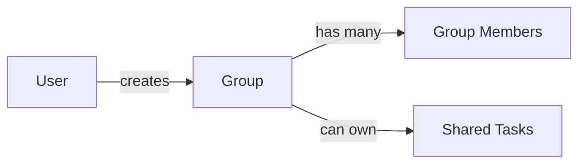

### Fields

```
_id
name
ownerId
createdAt
updatedAt
```

---

## Group Members

### Collection

```
groupMembers
```

### Fields

```
groupId
userId
role
```

### Roles

```
owner
admin
member
```

---

## Shared Tasks

### New Task Field

```
assignees[]
```

### Example

```json
{
  "title": "Deploy Application",
  "assignees": [
    "user1",
    "user2"
  ]
}
```

---

# 🔔 Phase 4: Notifications

## Notification Collection

### Fields

```
_id
userId
message
isRead
createdAt
```

## Notifications (visual)

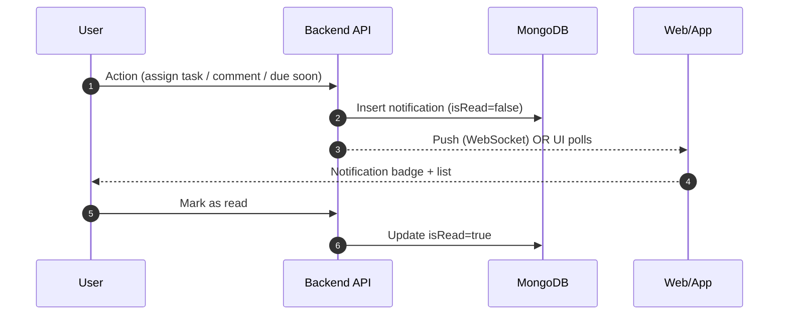

### Example

```json
{
  "userId": "...",
  "message": "Task assigned to you",
  "isRead": false
}
```

---

## Notification APIs

```
GET /api/notifications
PUT /api/notifications/:id/read
```

---

# 📧 Phase 5: Email Reminders

## New Task Fields

```
dueDate
reminderAt
```

## Email reminders (visual)

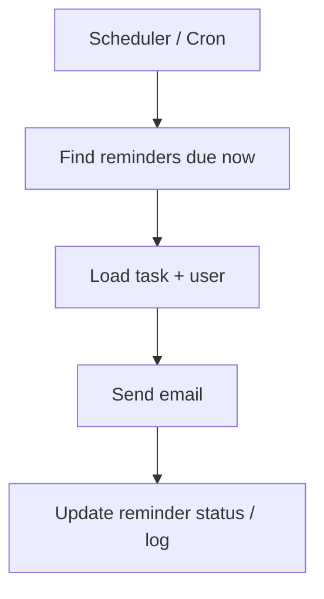

### Example

```json
{
  "title": "Prepare Interview",
  "dueDate": "2026-06-15",
  "reminderAt": "2026-06-14T09:00:00Z"
}
```

---

## Reminder Service

```
Cron Job
      ↓
Find Due Reminders
      ↓
Send Email
      ↓
Update Reminder Status
```

---

# 🤖 Phase 6: AI Productivity Features

## AI Task Breakdown

Input:

```
Prepare for MongoDB Interview
```

Output:

```
Learn Aggregation
Practice $lookup
Practice $group
Build Project
```

---

## AI Suggestions

### Features

```
Priority Recommendation
Due Date Recommendation
Task Breakdown
Weekly Summary
Project Health Report
```

---

# ⚡ Phase 7: Real-Time Features

## WebSockets

### Use Cases

```
Live Notifications
Task Updates
Comment Updates
Online Presence
```

---

## Real-Time Flow

```
User A Updates Task
          ↓
Server Receives Update
          ↓
WebSocket Event Emitted
          ↓
User B Sees Change Instantly
```

---

# 📈 Future Analytics

## Dashboard Metrics

### User Metrics

```
Tasks Completed
Tasks Pending
Completion Rate
Overdue Tasks
```

### Project Metrics

```
Tasks Per Project
Project Progress
Team Productivity
```

# 🧠 Engineering Concepts Covered

## Backend

```
REST APIs
Authentication
Authorization
Middleware
CRUD Operations
Validation
Error Handling
```

## Database

```
MongoDB
Mongoose
Schema Design
Relationships
Indexes
Aggregation Pipelines
```

## Security

```
Password Hashing
JWT Authentication
Protected Routes
Role-Based Access Control
```

## Scalability

```
Pagination
Filtering
Search
Indexing
Caching (Future)
```

## Advanced Concepts

```
WebSockets
Cron Jobs
Email Services
Audit Logging
AI Integrations
Real-Time Systems
```

---

# 🎯 Resume Outcome

By the end of this roadmap, TodoFlow will demonstrate:

```
✔ Full Stack Development

✔ MongoDB & Database Design

✔ Authentication & Authorization

✔ Search, Filtering & Pagination

✔ Real-Time Communication

✔ Background Job Processing

✔ Team Collaboration Features

✔ AI Integration

✔ Production-Oriented Architecture
```

This transforms the project from a simple Todo application into a portfolio-worthy system that touches many of the concepts interviewers expect from modern Full Stack engineers.

---

---

---

---

---